# Car Prices Prediction Model

## Introduction

Dealerships need to know the value of car prices. We have a [vehicles](data/vehicles.csv) dataset that can be used to build models to help dealerships estimate these prices.

Here is the [Jupyter notebook](prompt_II.ipynb) containing all the code for this use case.

## Data Understanding

This dataset contains approximately 426,000 records, making it a robust starting point, and includes 17 features. Let's examine the dataset to assess its content and quality.

The dataset has numerous duplicates and null values. The following plots illustrate these issues:

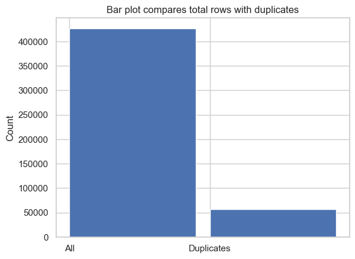 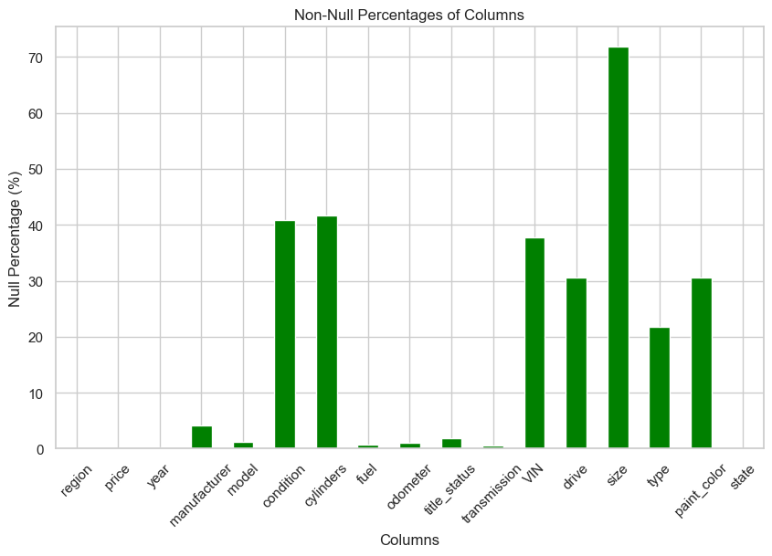

Additionally, here are some other plots that provide insights into the data:

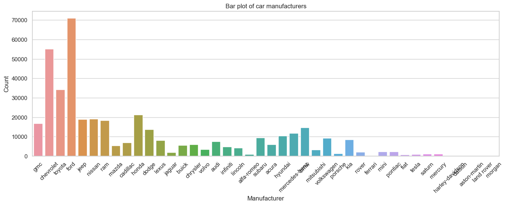 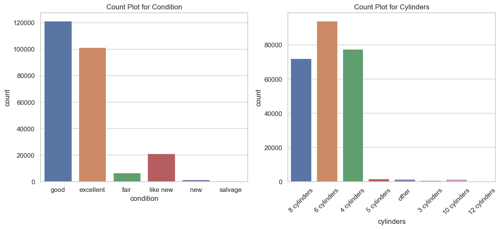

There are also a few outliers in the target 'price' feature. This box plot highlights those outliers:

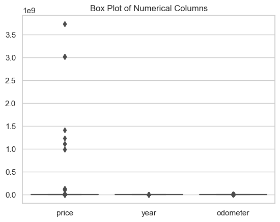

Below is the histogram of the price feature:

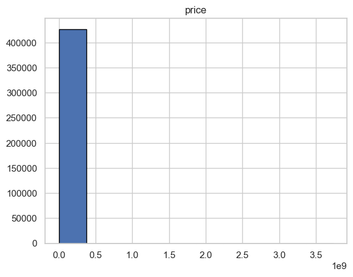

## Data Cleanup

This dataset contains a few features that do not impact model performance, such as id and VIN, so these columns were dropped.

Additionally, the size feature has more than 70% null values and was removed since it is unlikely to add significant value in predicting the car's price.

All duplicate values were eliminated, and null values were replaced with the most frequent occurrences for categorical features and the mean for numerical features.

Outliers were removed using interquartile techniques. Here is a plot showing the data distribution after outlier removal:

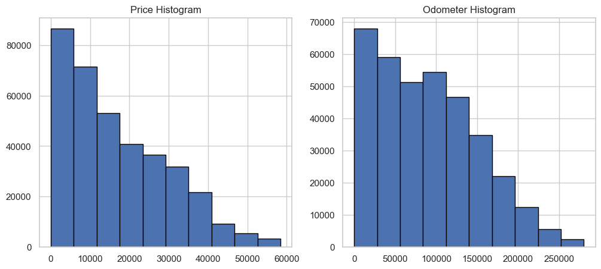

Here are a few more plots illustrating the data distribution after handling null values:

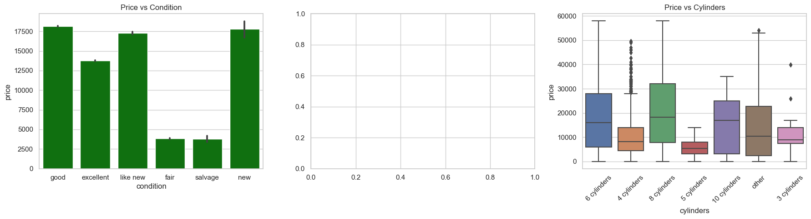

After cleaning up the null values, [LabelEncoder](https://scikit-learn.org/stable/modules/generated/sklearn.preprocessing.LabelEncoder.html) and [TargetEncoder](https://scikit-learn.org/stable/modules/generated/sklearn.preprocessing.TargetEncoder.html) were used to encode categorical values.

Here is the correlation matrix heatmap following the data cleanup:

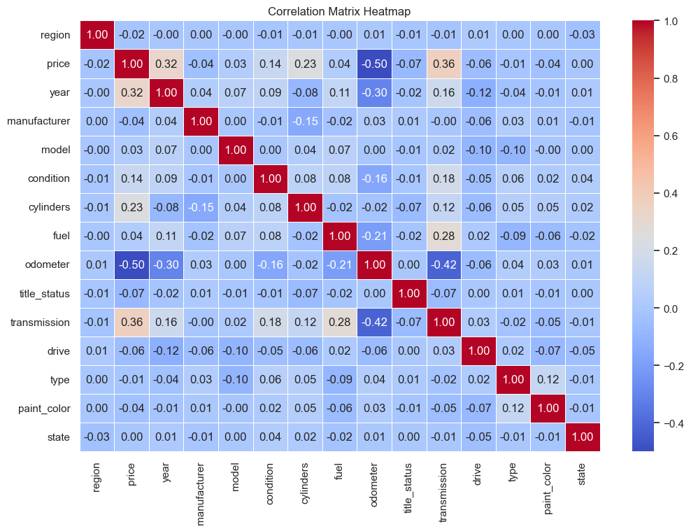

##  Model Building

Let's review the model built for this use case.

First, a basic [Linear Regression](https://scikit-learn.org/stable/modules/generated/sklearn.linear_model.LinearRegression.html) model was implemented to establish a baseline performance, achieving around 37% accuracy.

Subsequently, the model performance was enhanced using [StandardScaler](https://scikit-learn.org/stable/modules/generated/sklearn.preprocessing.StandardScaler.html), [PCA](https://scikit-learn.org/stable/modules/generated/sklearn.decomposition.PCA.html), and [K-Means](https://scikit-learn.org/stable/modules/generated/sklearn.cluster.KMeans.html).

Here is the plot for the PCA analysis:
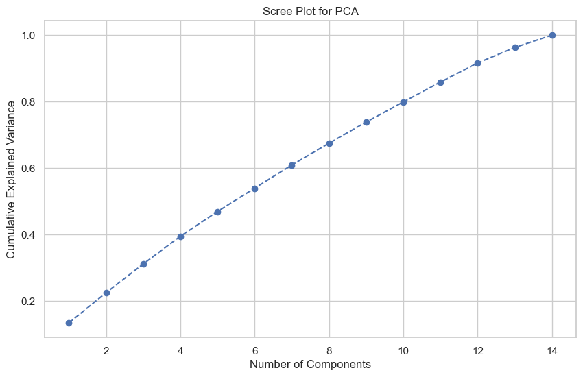

Various models were used, including Linear Regression, Lasso, Ridge, Bayesian Ridge, and Elastic Net.

Techniques such as Sequential Feature Selection and Polynomial Features were employed to identify optimal features and improve model performance.

The model was evaluated using cross-validation, as illustrated in this plot:
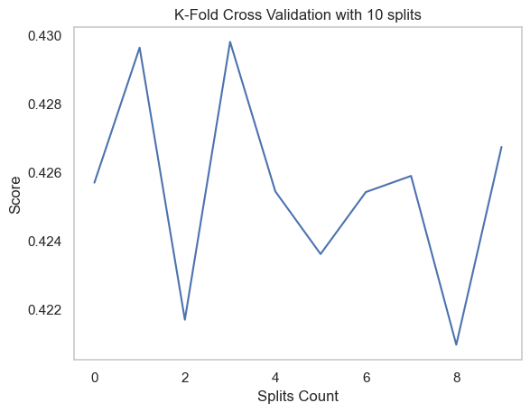

Finally, the Pipeline from sklearn was used to encapsulate the model steps, and GridSearchCV was utilized to fine-tune the hyperparameters.

The following plot shows how each model performed on the training and testing datasets:
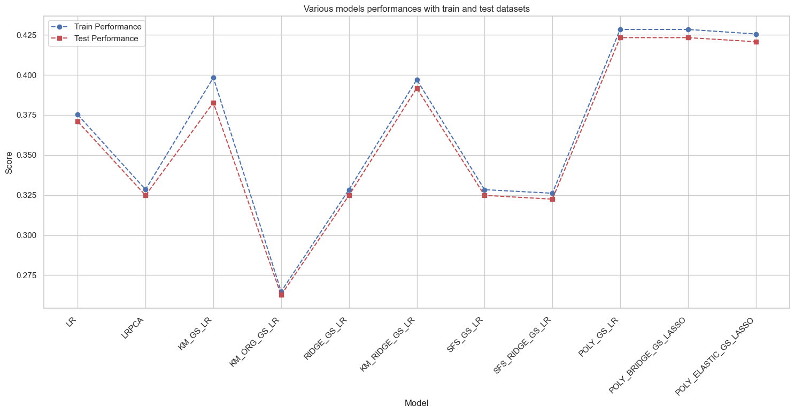

## Deployment
The model artifact was created using the joblib library from sklearn. Here is the final artifact: [model](car_price_prediction_pipeline.joblib).

This model can be deployed on cloud or on-premise servers and made available for end-user applications.

## Conclusion
Here are a few considerations for improving model performance:

1. Ensure the dataset is of high quality.
2. Evaluate additional logistic regression models.
3. Consider using a dataset with millions of records.

